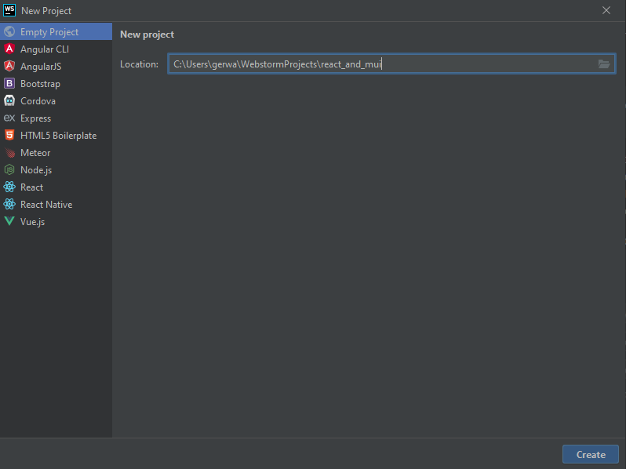
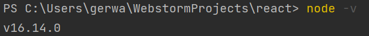
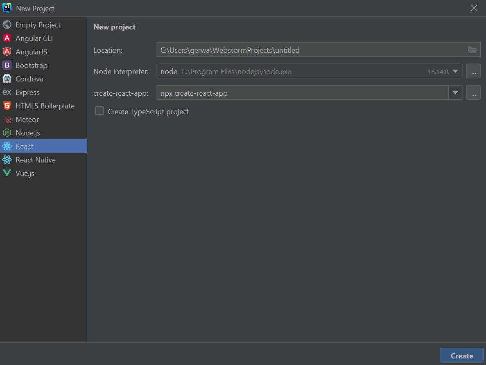

# React and Material UI

Today we are taking a closer look at [React](https://reactjs.org/). To be more specific at [ReactJS](https://www.w3schools.com/REACT/default.asp), which is an open
source JavaScript library used to build user interfaces for Web Applications in form of a SPA (Single Page Application).
It was developed by Facebook in 2011 and published in 2013. Components are the center of
attention in React. They are used for building complex UIs. ReactJS is similar to
React Native, which is an open-source JavaScript framework used for developing cross-plattform
Mobile Applications. We won't hear more about it today, but for further details visit: **[this website](https://www.javatpoint.com/reactjs-vs-reactnative#:~:text=of%20native%20tools.-,React%20Native,web%20components%20as%20building%20blocks.)**.

## Hello World

There are a lot of different options for a Hello World program. For example:

1. Just add this to your [HTML website](https://reactjs.org/docs/hello-world.html) (which in this case only consists of a div with the id root):
   `<div id="root"><div>`

   ```
   const root = React.DOM.createRoot(document.getElementById('root');
   root.render(<h1>Hello World!</h1>);
   ```
2. Use an IDE of your choice. I am using Webstorm. Create an empty project. 

   Make sure that you are in a folder with a name, that does not include capital letters or spaces and is no reserved word like (react, react-dom or react-scripts).
   Check if you have node installed. Just type
   ```
   node -v
   ```
   in the terminal.
   If you get an answer with a version number, you have node installed.
   
   

   Otherwise, visit: [nodejs.org](https://nodejs.org/en/download/) and download node (LTS is recommended). This [video](https://www.youtube.com/watch?v=VShtPwEkDD0) guides you through the process.
   To set up the application we only use one command. Please type
   ```
   npx create-react-app .
   ``` 
   in the terminal ([Create React App](https://create-react-app.dev/) comes with [Babel](https://babeljs.io/) and [Webpack](https://webpack.js.org/) otherwise, we would have to install both; this way we only need one build dependency).
   &nbsp;&nbsp;&nbsp;&nbsp;&nbsp;&nbsp;

   Now enter
   ```
   npm start
   ``` 
   for starting a development server.

   ### `npm start`

   Runs the app in the development mode.\

   Open [http://localhost:3000](http://localhost:3000) to view it in your browser.

   The page will reload when you make changes.\

   You may also see any lint errors in the console.

   ### `npm run build`

   Builds the app for production to the `build` folder.\

   It correctly bundles React in production mode and optimizes the build for the best performance.

   The build is minified and the filenames include the hashes.\

   Your app is ready to be deployed!

   See the section about [deployment](https://facebook.github.io/create-react-app/docs/deployment) for more information.

   
   Navigate to src > App.js and subsitute
   ```
   return <h1>Hello World!</h1>; 
   ```
   as your return statement. Now take a look at your browser :)


3. Open Webstorm, click on File > New > Project... and select React. 
   Again, make sure that the project name does not include capital letters or spaces and is no reserved word like (react, react-dom or react-scripts). Check if you have node installed. Just type
   ```
   node -v
   ```
   in the terminal.
   If you get an answer with a version number, you have node installed.
   

   Click on Create and wait ;) You have created a Create React App (bootstrapped with [Create React App](https://github.com/facebook/create-react-app)). Now just type
   ```
   npm start
   ``` 
   in the terminal or just click on Run. A localhost website will automatically be shown.

   Navigate to src > index.js and subsitute
   ```
   <h1>Hello World!</h1>
   ``` 
   between <React.StrictMode></React.StrictMode> tags. Now take a look at your browser :)

## Let's have a clean up

Delete everything that is overhead:
In the public folder delete: everything but the index.html
Now open the index.html and delete all unnecessary lines. At the end it should look like this:
```
<!DOCTYPE html>
<html lang="en">
  <head>
    <meta charset="utf-8" />
    <meta name="viewport" content="width=device-width, initial-scale=1" />
    <meta name="description" content="Web site created using create-react-app"/>
    <title>React and Material UI</title>
  </head>
  <body>
    <div id="root"></div>
  </body>
</html> 
```


In the src folder delete everything, but the App.js and the index.js.
Open App.js and delete unused content.
Now it should look like:
```
function App() {
return (
<h1>Hello World!</h1>
);
}
```

As our last cleaning step, please open index.js and delete unused lines.
Now it should look like:
```
import React from 'react';
import ReactDOM from 'react-dom/client';
import App from './App';

const root = ReactDOM.createRoot(document.getElementById('root'));
root.render(
<React.StrictMode>
<App/>
</React.StrictMode>
);

export default App;
```

Check your browser if our app still works :)

## Much Ado About Components

We have our Application running. Now let's dive in a lil deeper and use a component for showing our Hello World text. For this purpose we will add a new file and import it in our App.js
But first we need some structure. Let's store all of our components at the same place.
Create a directory called components. As our next step create a file named HelloWorld.js in our component directory.
Add this code:
```
import React from "react";

function HelloWorld(){
    return <h1>Hello World!</h1>;
}

export default HelloWorld
```

In the App.js substitute `<h1>Hello World!</h1>` with the component we just created:
```
<HelloWorld/>
```
Don't forget to import your brand-new component.

**PROPER JOB!** You are close to mastering React.

# Advanced example
## Material-UI

[MUI](https://mui.com/) is a UI component library for React. The style follows the [material design
specification](https://material.io/design), which is a design specification/philosophy by [Google](https://duckduckgo.com/).
We need to [install](https://mui.com/material-ui/getting-started/installation/) MUI.
Open a new terminal and type in:
```
npm install @mui/material @emotion/react @emotion/styled
```

Mui uses Roboto fonds so go to public > index.html and add this link:
```
<link rel="stylesheet" href="https://fonts.googleapis.com/css?family=Roboto:300,400,500,700&display=swap"/>
```
Your index.html should look something like this:
```
 <!DOCTYPE html>
<html lang="en">
  <head>
    <meta charset="utf-8" />
    <meta name="viewport" content="width=device-width, initial-scale=1" />
    <meta name="description" content="Web site created using create-react-app"/>
    <link rel="stylesheet" href="https://fonts.googleapis.com/css?family=Roboto:300,400,500,700&display=swap"/>
    <title>React and Material UI</title>
  </head>
  <body>
    <div id="root"></div>
  </body>
</html>
```
Now we can start using MUI components :)

### Pro tip
If you want to use MUI components take a look at the [documentation](https://mui.com/material-ui/react-autocomplete/) of MUI first.
The documentation is very well written and extremely helpful!

## Our goal
Let's create a frontpage with Card-Components that show pictures, some text and can be rated.

### Let's create a new component
Go to src > components and add a new component called Cards.js
The file is empty, but you can autofill it by typing in
```
rsc
```
and hitting enter. This will generate a stateless component for you. Take a look at autofill for other useful shortcuts.

Now navigate to src > App.js and substitute the `<HelloWorld/>` component for the `<Cards/>` component. Also swap the import statement for the Cards component.
The App.js should look like this:
```
import Cards from "./components/Cards";

function App() {
  return (
    <Cards/>
  );
}

export default App;
```

Back to our new Cards component:
Open src > components > Cards.js and delete the div. Now let's mui around. Type in `<Typography>`. The IDE should autocomplete
and suggest the Typography component. When you hit enter the import statement will be added automatically. Very useful stuff...
The components work with props. If you wanna make some changes to the component take a look at the docu, what can be easily altered
with adding some props.

Add some text in between the Typography tags, like:
```
<Typography>Rate the Kunst</Typography>
```

Go to your browser and inspect your creation. Press F12 and inspect the text. You have created a <p></p> paragraph tag.
Let's play around a little bittle.

Add variant, component, color, align, and gutterBottom. This will change the size to h3 but make your component a h2.
It will display the text in the middle of the line and add some spacing to the bottom.
The component should look something like this:

```
<Typography variant={"h3"} component={"h2"} color={"secondary"} align={"center"} gutterBottom>Rate the Kunst</Typography>
```

Nice. If you want some space to the top you can add some css styling with the sx prop. Just add
```
sx={{marginTop:1}}
```
to the Typography.

To add more stuff to the Cards.js return statement we need some kind of wrapper, because only one return tag is allowed.
So just add a box around the Typography. Type in `<Box>` and autocompletion should do the rest for you.

Now add a card component. Just click under the Typography component and type in `<Card>`. Autocomplete should help you out.
Type something in between the <Card></Card> tags to see if it works.
Splendid :)

Let's divide the Card into three parts. Picture, Text and More. Mui can help you with this.
Add three components in between the <Card></Card> tag. Those are: CardMedia, CardContent and CardActions.
Use autocomplete to your advantage.
The card component should look like this:
```
<Card>
   <CardMedia></CardMedia>
   <CardContent></CardContent>
   <CardActions></CardActions>
</Card>
```

The card media should display a picture. Add the prop component, image, height and alt.

The <CardMedia/> component should look something like this:
```
<CardMedia component={"img"} image={"https://malen-lernen.org/wp-content/uploads/2019/03/gustav-klimt.jpg"} height={200} alt={"beautiful"}></CardMedia>
```
Take look at the browser. The image should be displayed at this point.

Next up, fill the CardContent with some text. Insert:
```
<Typography gutterBottom variant="h5" component="div">
   Gustav Klimt
</Typography>
<Typography variant="body2" color="text.secondary">
   «Die Goldene Adele» wie das Bild auch genannt wird, ist eines der berühmtesten Gemälde des Malers Gustav Klimt.
   Es ist im Jugendstil gehalten und mit Ölfarben gemalt. Zusätzlich hat Klimt auch Blattgold und Blattsilber aufgebracht,
   wodurch eine unverwechselbare Eleganz erreicht wurde.
   Das Bild ist im Rahmen eines Auftrages von Ferdinand Bloch-Bauer entstanden.
   Die Auftragsarbeit sollte Bloch Bauers Frau zeigen. Klimt erstellte daraufhin viele Zeichnungen und Studien,
   bis er das eigentliche Werk erschuf. Dieses Bild erzielte bei einem Verkauf den astronomischen Preis von 135 Millionen US-Dollar.
</Typography>
```

For our last part of the card, add some interactive stuff.
Add two `<Button/>` components, with the property size="small".
Let the buttons display some text like: Share and Learn More.
It should look something like:
```
<Button size={"small"}>Share</Button>
<Button size={"small"}>Learn More</Button>
```
Add `<Rating/>` component. The rating component sticks to the second button, so add some sx prop with a padding left.

As a next step, we will add some React Magic in form of the [useState](https://reactjs.org/docs/hooks-state.html) Hook.
What is a Hook? A Hook is a special function that lets you “hook into” React features. UseState is a Hook that lets you add React state to function components.

When would I use a Hook? If you write a function component and realize you need to add some state to it, previously you had to convert it to a class. Now you can use a Hook inside the existing function component. We’re going to do that right now!
Go to the top of the const and add the useState just above the return statement.
```
const [stars, setStars] = React.useState(null);
```
You just created a state variable called stars. This is a way to preserve some values between the function calls.
With setStars you just created a function that updates the current state.
The argument to the useState() function is the initial state.
React will remember its current value between re-renders, and provide the most recent one to our function.

Now let's use the two variables you just created in the rating component.
Set the value that is shown to the variable stars you just created. You can pass a JavaScript expression by enclosing it within [{}](https://reactjs.org/docs/jsx-in-depth.html).

Now add the onChange prop to call the setValue function with the current event.
The rating component should look similar to this:
```
<Rating
   sx={{paddingLeft:2}}
   value={stars}
   onChange={(event, newValue) => {
      setStars(newValue);
   }}
/>
```

The useState Hook should be working fine at this point.

### Let's recap: We have created two function components and a React Hook. 
We can display the card
component and have two buttons plus a rating system.

The Cards.js file looks something like this:
```
import React from 'react';
import {Box, Button, Card, CardActions, CardContent, CardMedia, Rating, Typography} from "@mui/material";

const Cards = () => {
    const [stars, setStars] = React.useState(null);
    return (
        <Box>
            <Typography variant={"h3"} component={"h2"} color={"secondary"} align={"center"} gutterBottom
                        sx={{marginTop: 1}}>Rate the Kunst</Typography>
            <Card>
                <CardMedia component={"img"} image={"https://malen-lernen.org/wp-content/uploads/2019/03/gustav-klimt.jpg"} height={200} alt={"beautiful"}></CardMedia>
                <CardContent>
                    <Typography gutterBottom variant="h5" component="div">
                        Gustav Klimt
                    </Typography>
                    <Typography variant="body2" color="text.secondary">
                        «Die Goldene Adele» wie das Bild auch genannt wird, ist eines der berühmtesten Gemälde des
                        Malers Gustav Klimt.
                        Es ist im Jugendstil gehalten und mit Ölfarben gemalt. Zusätzlich hat Klimt auch Blattgold und
                        Blattsilber aufgebracht,
                        wodurch eine unverwechselbare Eleganz erreicht wurde.
                        Das Bild ist im Rahmen eines Auftrages von Ferdinand Bloch-Bauer entstanden.
                        Die Auftragsarbeit sollte Bloch Bauers Frau zeigen. Klimt erstellte daraufhin viele Zeichnungen
                        und Studien,
                        bis er das eigentliche Werk erschuf. Dieses Bild erzielte bei einem Verkauf den astronomischen
                        Preis von 135 Millionen US-Dollar.
                    </Typography>
                </CardContent>
                <CardActions>
                    <Button size={"small"}>Share</Button>
                    <Button size={"small"}>Learn More</Button>
                    <Rating
                        sx={{paddingLeft: 2}}
                        value={stars}
                        onChange={(event, newValue) => {
                            setStars(newValue);
                        }}
                    />
                </CardActions>
            </Card>
        </Box>
    );
};

export default Cards;
```

The next step would be implementing more <Card/> tags in our Card.js. If we continue the
way we just did, we would have a lot of duplicated code. So let's
outsource the code for this specific card component we want.

Create a new component in src > components and call it something like
ArtCard.js

Type in rsc, hit enter and copy the code for our Card from the Cards.js file. To enter different pictures we need
a prop to pass the path to the picture down to the component. For the same purpose we need
props for the name and the text.
After that hand the props down to the components. The ArtCard.js file should look like this:
```
import React from 'react';
import {Button, Card, CardActions, CardContent, CardMedia, Rating, Typography} from "@mui/material";

const ArtCard = ({pathToImage, name, text}) => {
    const [stars, setStars] = React.useState(null);

    return (
        <Card>
            <CardMedia component={"img"} image={pathToImage} height={200} alt={"beautiful"}/>
            <CardContent>
                <Typography gutterBottom variant="h5" component="div">
                    {name}
                </Typography>
                <Typography variant="body2" color="text.secondary">
                    {text}
                </Typography>
            </CardContent>
            <CardActions>
                <Button size={"small"}>Share</Button>
                <Button size={"small"}>Learn More</Button>
                <Rating
                    sx={{paddingLeft: 2}}
                    value={stars}
                    onChange={(event, newValue) => {
                        setStars(newValue);
                    }}
                />
            </CardActions>
        </Card>
    );
};

export default ArtCard;
```

In Cards.js we add the <ArtCard/> component with the props pathToImage, name and text.
We can do this with as many <ArtCard/> components as we like.
The file should now look something like:
```
import React from 'react';
import {Box, Typography} from "@mui/material";
import ArtCard from "./ArtCard";

const Cards = () => {
    return (
        <Box>
            <Typography variant={"h3"} component={"h2"} color={"secondary"} align={"center"} gutterBottom
                        sx={{marginTop: 1}}>Rate the Kunst</Typography>
            <ArtCard
                pathToImage={"https://malen-lernen.org/wp-content/uploads/2019/03/jan-vermeer.jpg"}
                name={"Johannes Vermeer"}
                text={"Jan Vermeers berühmtes Gemälde «Das Mädchen mit dem Perlenohrgehänge» ist mit Ölfarben auf Leinwand gemalt\n" +
                "und im Barock-Stil gemalt. Die Bildkomposition ist relativ simpel: bis auf das Porträt lässt sich\n" +
                "ansonsten kein Hintergrund oder etwas aus der Umgebung ausmachen. Vermeer hat Das Mädchen mit dem Perlenohrgehänge\n" +
                "1665 fertiggestellt und rückte 2003 ins Zentrum der Aufmerksamkeit, als ein Oscar prämierter Film gleichen Namens\n" +
                "in den Kinos lief."}/>
            <ArtCard
                pathToImage={"https://malen-lernen.org/wp-content/uploads/2019/03/van-gogh-sternennacht.jpg"}
                name={"Vincent van Gogh"}
                text={"Vincent Van Gogh sollte jedem Kunstinteressierten ein Begriff sein. Sein Werk Sternennacht ist eines der bekanntesten Bilder überhaupt.\n" +
                "Van Gogh malte dieses Kunstwerk 1889 im Stile des frühen Expressionismus mit Ölfarbe.\n" +
                "Über die Entstehungsgeschichte ist kaum etwas bekannt, nur dass es in einer Zeit entstanden ist,\n" +
                "in der van Gogh psychische Probleme hatte und in einer Nervenheilanstalt war. Zu sehen ist dieses Bild im Museum of Modern Art\n" +
                "in New York."}/>
            <ArtCard
                pathToImage={"https://malen-lernen.org/wp-content/uploads/2019/03/das-letzte-abendmahl.jpg"}
                name={"Leonardo Da Vinci"}
                text={"Das letzte Abendmahl. Es handelt sich dabei um das wohl berühmteste Wandgemälde der Welt.\n" +
                "Für die Erstellung kam die Secco-Technik zum Einsatz, das Wandgemälde wurde 1497 durch Da Vinci fertiggestellt.\n" +
                "Die Masse dieses imposanten Bildes beträgt 4m x 9m. Die perspektiv korrekt dargestellte Szenerie war für\n" +
                "die damalige Zeit wegweisend. Es gab einige Versuche, die Wandmalerei zu restaurieren.\n" +
                "Der weitere Zerfall wurde aufgehalten, weitere Schutzmassnahmen wie eine Staubschleuse sollen dafür sorgen,\n" +
                "dass dies auch so bleibt. Eine begrenzte Anzahl BesucherInnen können im Dominikanerkloster\n" +
                "«Santa Maria delle Grazie» in Mailand dieses einmalige Werk begutachten."}/>
            <ArtCard
                pathToImage={"https://malen-lernen.org/wp-content/uploads/2019/03/ber%C3%BChmte-gemaelde-hokusai.jpg"}
                name={"Katsushika Hokusai"}
                text={"Katsushika Hokusai war ein bekannter japanischer Maler, der vor allem für seine Landschaftsbilder berühmt war.\n" +
                "Der Holzschnitte «Die grosse Welle vor Kanagawa» ist Teil einer Serie von 46 Bildern,\n" +
                "in der Hokusai die Landschaft rund um den Berg Fuji darstellte.\n" +
                "Die Bilderserie ist zwischen 1829 und 1833 entstanden und erfuhr im Laufe der Zeit eine beachtliche Bekanntheit.\n" +
                "Die grosse Welle vor Kanagawa wurde mehrfach nachgemalt bzw. interpretiert, dies interessanterweise vor allem in Europa.\n" +
                "Es handelt sich hier um eines der bekanntesten japanischen Bilder überhaupt,\n" +
                "weshalb es in unserer Liste mit bekannten Bildern und Gemälden nicht fehlen darf."}/>
            <ArtCard
                pathToImage={"https://malen-lernen.org/wp-content/uploads/2019/03/gustav-klimt.jpg"}
                name={"Gustav Klimt"}
                text={"«Die Goldene Adele» wie das Bild auch genannt wird, ist eines der berühmtesten Gemälde des Malers Gustav Klimt.\n" +
                "Es ist im Jugendstil gehalten und mit Ölfarben gemalt. Zusätzlich hat Klimt auch Blattgold und Blattsilber aufgebracht,\n" +
                "wodurch eine unverwechselbare Eleganz erreicht wurde.\n" +
                "Das Bild ist im Rahmen eines Auftrages von Ferdinand Bloch-Bauer entstanden.\n" +
                "Die Auftragsarbeit sollte Bloch Bauers Frau zeigen. Klimt erstellte daraufhin viele Zeichnungen und Studien,\n" +
                "bis er das eigentliche Werk erschuf. Dieses Bild erzielte bei einem Verkauf den astronomischen Preis von 135 Millionen US-Dollar."}/>
            <ArtCard
                pathToImage={"https://upload.wikimedia.org/wikipedia/commons/a/a8/Van_Gogh_Self-Portrait_with_Straw_Hat_1887-Metropolitan.jpg"}
                name={"Vincent van Gogh"}
                text={" Van Gogh gilt als einer der Begründer der modernen Malerei. Als Schüler erhielt er Mal- und Zeichenunterricht\n" +
                "von Constant Cornelis Huijsmans, später von seinem Vetter Anton Mauve. Er hinterließ über 900 Gemälde und 1000 Zeichnungen.\n" +
                "Die Gemälde entstanden überwiegend in den letzten zehn Lebensjahren. Van Gogh führte einen umfangreichen Briefwechsel,\n" +
                "vor allem mit seinem Bruder Theo, dem Händler seiner Bilder, der eine Fülle von Hinweisen auf sein malerisches Werk enthält.\n" +
                "Die ersten Zeichnungen des Jugendlichen finden sich dort, und viele der Gemälde hat Vincent in seinen Briefen an Theo vorgezeichnet."}/>
        </Box>
    );
}

export default Cards;
```

## Display cards side by side

In the next step we will put two card components in one line and make them responsive, so that with a small screen only
one card is displayed in a line.
We use [grids](https://mui.com/material-ui/react-grid/) for this.

In our Cards.js file we will swap the outer box for a `<Grid></Grid>` and make it a grid container.
Then we wrap the `<Typography/>` and each `<ArtCard>` with a grid item and set the props accordingly.

The file should look similar to this:
```
import React from 'react';
import {Grid, Typography} from "@mui/material";
import ArtCard from "./ArtCard";

const Cards = () => {
    return (
        <Grid container spacing={2}>
            <Grid item xs={12}>
            <Typography variant={"h3"} component={"h2"} color={"secondary"} align={"center"} gutterBottom
                        sx={{marginTop: 1}}>Rate the Kunst</Typography>
            </Grid>
            <Grid item xs={12} sm={6} display={"flex"}>
                <ArtCard
                    pathToImage={"https://malen-lernen.org/wp-content/uploads/2019/03/jan-vermeer.jpg"}
                    name={"Johannes Vermeer"}
                    text={"Jan Vermeers berühmtes Gemälde «Das Mädchen mit dem Perlenohrgehänge» ist mit Ölfarben auf Leinwand gemalt\n" +
                    "und im Barock-Stil gemalt. Die Bildkomposition ist relativ simpel: bis auf das Porträt lässt sich\n" +
                    "ansonsten kein Hintergrund oder etwas aus der Umgebung ausmachen. Vermeer hat Das Mädchen mit dem Perlenohrgehänge\n" +
                    "1665 fertiggestellt und rückte 2003 ins Zentrum der Aufmerksamkeit, als ein Oscar prämierter Film gleichen Namens\n" +
                    "in den Kinos lief."}/>
            </Grid>
            <Grid item xs={12} sm={6} display={"flex"}>
                <ArtCard
                    pathToImage={"https://malen-lernen.org/wp-content/uploads/2019/03/van-gogh-sternennacht.jpg"}
                    name={"Vincent van Gogh"}
                    text={"Vincent Van Gogh sollte jedem Kunstinteressierten ein Begriff sein. Sein Werk Sternennacht ist eines der bekanntesten Bilder überhaupt.\n" +
                    "Van Gogh malte dieses Kunstwerk 1889 im Stile des frühen Expressionismus mit Ölfarbe.\n" +
                    "Über die Entstehungsgeschichte ist kaum etwas bekannt, nur dass es in einer Zeit entstanden ist,\n" +
                    "in der van Gogh psychische Probleme hatte und in einer Nervenheilanstalt war. Zu sehen ist dieses Bild im Museum of Modern Art\n" +
                    "in New York."}/>
            </Grid>
            <Grid item xs={12} sm={6} display={"flex"}>
                <ArtCard
                    pathToImage={"https://malen-lernen.org/wp-content/uploads/2019/03/das-letzte-abendmahl.jpg"}
                    name={"Leonardo Da Vinci"}
                    text={"Das letzte Abendmahl. Es handelt sich dabei um das wohl berühmteste Wandgemälde der Welt.\n" +
                    "Für die Erstellung kam die Secco-Technik zum Einsatz, das Wandgemälde wurde 1497 durch Da Vinci fertiggestellt.\n" +
                    "Die Masse dieses imposanten Bildes beträgt 4m x 9m. Die perspektiv korrekt dargestellte Szenerie war für\n" +
                    "die damalige Zeit wegweisend. Es gab einige Versuche, die Wandmalerei zu restaurieren.\n" +
                    "Der weitere Zerfall wurde aufgehalten, weitere Schutzmassnahmen wie eine Staubschleuse sollen dafür sorgen,\n" +
                    "dass dies auch so bleibt. Eine begrenzte Anzahl BesucherInnen können im Dominikanerkloster\n" +
                    "«Santa Maria delle Grazie» in Mailand dieses einmalige Werk begutachten."}/>
            </Grid>
            <Grid item xs={12} sm={6} display={"flex"}>
                <ArtCard
                    pathToImage={"https://malen-lernen.org/wp-content/uploads/2019/03/ber%C3%BChmte-gemaelde-hokusai.jpg"}
                    name={"Katsushika Hokusai"}
                    text={"Katsushika Hokusai war ein bekannter japanischer Maler, der vor allem für seine Landschaftsbilder berühmt war.\n" +
                    "Der Holzschnitte «Die grosse Welle vor Kanagawa» ist Teil einer Serie von 46 Bildern,\n" +
                    "in der Hokusai die Landschaft rund um den Berg Fuji darstellte.\n" +
                    "Die Bilderserie ist zwischen 1829 und 1833 entstanden und erfuhr im Laufe der Zeit eine beachtliche Bekanntheit.\n" +
                    "Die grosse Welle vor Kanagawa wurde mehrfach nachgemalt bzw. interpretiert, dies interessanterweise vor allem in Europa.\n" +
                    "Es handelt sich hier um eines der bekanntesten japanischen Bilder überhaupt,\n" +
                    "weshalb es in unserer Liste mit bekannten Bildern und Gemälden nicht fehlen darf."}/>
            </Grid>
            <Grid item xs={12} sm={6} display={"flex"}>
                <ArtCard
                    pathToImage={"https://malen-lernen.org/wp-content/uploads/2019/03/gustav-klimt.jpg"}
                    name={"Gustav Klimt"}
                    text={"«Die Goldene Adele» wie das Bild auch genannt wird, ist eines der berühmtesten Gemälde des Malers Gustav Klimt.\n" +
                    "Es ist im Jugendstil gehalten und mit Ölfarben gemalt. Zusätzlich hat Klimt auch Blattgold und Blattsilber aufgebracht,\n" +
                    "wodurch eine unverwechselbare Eleganz erreicht wurde.\n" +
                    "Das Bild ist im Rahmen eines Auftrages von Ferdinand Bloch-Bauer entstanden.\n" +
                    "Die Auftragsarbeit sollte Bloch Bauers Frau zeigen. Klimt erstellte daraufhin viele Zeichnungen und Studien,\n" +
                    "bis er das eigentliche Werk erschuf. Dieses Bild erzielte bei einem Verkauf den astronomischen Preis von 135 Millionen US-Dollar."}/>
            </Grid>
            <Grid item xs={12} sm={6} display={"flex"}>
                <ArtCard
                    pathToImage={"https://upload.wikimedia.org/wikipedia/commons/a/a8/Van_Gogh_Self-Portrait_with_Straw_Hat_1887-Metropolitan.jpg"}
                    name={"Vincent van Gogh"}
                    text={" Van Gogh gilt als einer der Begründer der modernen Malerei. Als Schüler erhielt er Mal- und Zeichenunterricht\n" +
                    "von Constant Cornelis Huijsmans, später von seinem Vetter Anton Mauve. Er hinterließ über 900 Gemälde und 1000 Zeichnungen.\n" +
                    "Die Gemälde entstanden überwiegend in den letzten zehn Lebensjahren. Van Gogh führte einen umfangreichen Briefwechsel,\n" +
                    "vor allem mit seinem Bruder Theo, dem Händler seiner Bilder, der eine Fülle von Hinweisen auf sein malerisches Werk enthält.\n" +
                    "Die ersten Zeichnungen des Jugendlichen finden sich dort, und viele der Gemälde hat Vincent in seinen Briefen an Theo vorgezeichnet."}/>
            </Grid>
        </Grid>
    );
}

export default Cards;
```

## Themes

In our last step we add a global theme to our project. For this we go to
src > App.js and wrap the `<Cards/>` component with a `<ThemeProvider></ThemeProvider>`, implement
the const theme, that we pass to the prop of the ThemeProvider. Then we change the secondary theme color to pink. Don' forget to import
createTheme and the color pink.

The App.js file should look like this:
```
import Cards from "./components/Cards";
import {createTheme, ThemeProvider} from "@mui/material";
import {pink} from "@mui/material/colors";

// https://mui.com/material-ui/customization/default-theme/
const theme = createTheme({
    palette:{
        secondary: pink
    }
})

function App() {
    return (
        <ThemeProvider theme={theme}>
            <Cards/>
        </ThemeProvider>
    );
}

export default App;

```

### React is a library, so we do not have routing included
That's why we need to install [React Router](https://reactrouter.com/docs/en/v6/getting-started/installation).
Just open a new terminal and type in `npm install react-router-dom@6`.

But implementing this will have to wait for a future project.

Thanks for participating and have a great day!